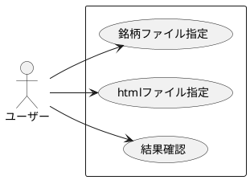
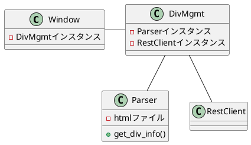
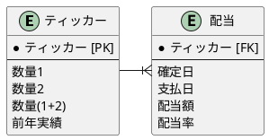

# 配当管理

## 流れ

1. 使用する機能を単体でコーディング
   - Beautiful Soup
     - 始めて使う。保存した html ファイルから必要な情報を抽出する
   - tkinter
     - 初めて使う。ファイル指定を GUI で行う
   - rest
     - 始めて使う。配当情報や銘柄情報を保管し、抽出
2. ドキュメント作成
3. インテグレーション

## 機能要件

- html ファイルに保管されたある期間の配当情報を抽出
- 保有銘柄だった場合画面に表示
- 画面表示をコピーできる

## 非機能要件

## epic

- ユーザーとして、保有銘柄の配当確定日を知りたい
- ユーザーとして、該当銘柄の前年実績をあわせて知りたい

## ユースケース



### クラス

- ウィンドウ
- 配当管理
- パーサー
- レストクライアント



- [ ] ウィンドウインスタンスを呼び出す際、配当管理インスタンスを引数として渡す
- [ ] ウィンドウインスタンスは、配当ファイルセット、銘柄ファイルセット、配当処理の 3 メソッドを利用
- [ ] 配当管理はパーサーに配当ファイル名を渡して配当情報を受取る(get_div_info)
- [ ] 配当管理はレストクライアントの record_div_info を利用する

## データベース



### 結果確認

1. 結果確認イメージ@1st ステージ

```
MSS 2021-10-18 3.1%
MC  2021-10-20 3.0%
```

2. 結果確認イメージ@2nd ステージ

```
MSS 2021-10-18 3.1%   |  昨年実績 3.5%
MC  2021-10-20 3.0%   |  昨年実績 2.0%
```

## 処理の流れ


<!-- 
```plantuml
@startuml
:htmlファイル指定 & 銘柄ファイル指定;
:フォーマットチェック;
note right
日付
配当額
end note
repeat
:配当情報登録;
:銘柄チェック;
repeat while (more data?)
:結果表示;
@enduml
``` -->
<!-- 
```plantuml
@startuml
|メイン|
start
:GUI呼出;
|GUI|
:ウィンドウ1
(ファイル指定);
:ウィンドウ2
(パーサー呼出);
|パーサー|

<!-- :配当情報取得;
if (保有銘柄？) then (yes)
|django|
:配当情報登録;
|パーサー|
:結果準備;
' repeat while (more data?)
|GUI|
:ウィンドウ 2
(結果表示);

|メイン|
stop
@enduml

```` -->

<!-- ```plantuml
@startuml
|メイン|
start
:GUI呼出;
|GUI|
:ウィンドウ1
(ファイル指定);
:ウィンドウ2
(パーサー呼出);

|x|
while (配当情報あり?)
  :配当情報読み込み;
  if ("保有銘柄") then
  else
    |as|
    :登録;
    |x|
    :結果準備;

  ' else
  endif
endwhile
:結果準備;
stop
@enduml
``` -->

## エラー処理

配当ファイルが存在しない
銘柄ファイルが存在しない
レストでエラー
銘柄情報が登録されていない

## todo

- 銘柄情報
  1. モデル更新
  2. シリアライズ
  3. 実際に登録
  4. 検索
     - ティッカーコードを指定して昨年の実績(配当額)を取得
