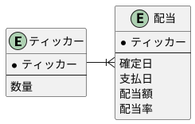

# uml test
test uml

```plantuml
@startuml
entity "ティッカー" as ticker {
  * ティッカー
  --
  数量
} 
entity "配当" as dividend {
  * ティッカー
  --
  確定日
  支払日
  配当額
  配当率
} 
ticker -|{ dividend
' - --で並びが変わる
@enduml
```