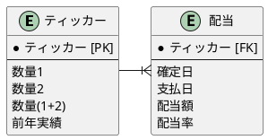
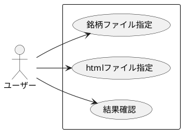
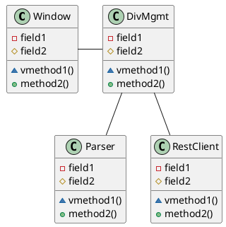
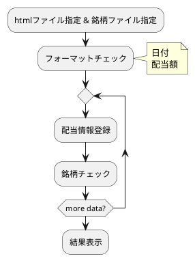

# 配当管理

## 流れ
1. 使用する機能を単体でコーディング
   - Beautiful Soup
   - tkinter
   - rest
2. ドキュメント作成
3. インテグレーション

## データベース


## ユースケース



### クラス
- ウィンドウ
- 配当管理
- パーサー
- レストクライアント




- [ ] ウィンドウインスタンスを呼び出す際、配当管理インスタンスを引数として渡す
- [ ] ウィンドウインスタンスは、配当ファイルセット、銘柄ファイルセット、配当処理の3メソッドを利用
- [ ] 配当管理はパーサーに配当ファイル名を渡して配当情報を受取る(get_div_info)
- [ ] 配当管理はレストクライアントのrecord_div_infoを利用する

## エラー処理
配当ファイルが存在しない
銘柄ファイルが存在しない
レストでエラー


### 結果確認

1. 結果確認イメージ@1st ステージ

```
MSS 2021-10-18 3.1%
MC  2021-10-20 3.0%
```

2. 結果確認イメージ@2nd ステージ

```
MSS 2021-10-18 3.1%   |  昨年実績 3.5%
MC  2021-10-20 3.0%   |  昨年実績 2.0%
```

## 処理の流れ

<!-- 


```plantuml
@startuml
|メイン|
start
:GUI呼出;
|GUI|
:ウィンドウ1
(ファイル指定);
:ウィンドウ2
(パーサー呼出);

|x|
while (配当情報あり?)
  :配当情報読み込み;
  if ("保有銘柄") then
  else
    |as|
    :登録;
    |x|
    :結果準備;

  ' else 
  endif
endwhile
:結果準備;
stop
@enduml
``` -->
