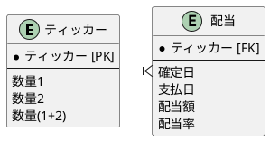
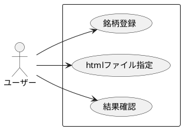
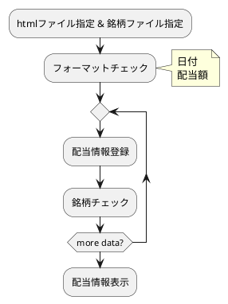
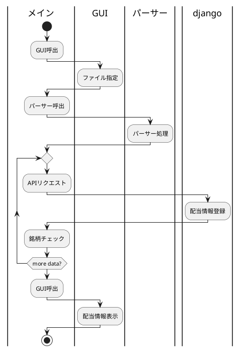

# uml test

test uml

```plantuml
@startuml
entity "ティッカー" as ticker {
  * ティッカー [PK]
  --
  数量1
  数量2
  数量(1+2)
}
entity "配当" as dividend {
  * ティッカー [FK]
  --
  確定日
  支払日
  配当額
  配当率
}
ticker -|{ dividend


' - --で並びが変わる
@enduml
```

```plantuml
@startuml
left to right direction
actor "ユーザー" as user
rectangle {
usecase "銘柄登録" as UC1
usecase "htmlファイル指定" as UC2
usecase "結果確認" as UC3
}
user --> UC1
user --> UC2
user --> UC3
@enduml
```

```plantuml
@startuml
:htmlファイル指定 & 銘柄ファイル指定;
:フォーマットチェック;
note right
日付
配当額
end note
repeat
:配当情報登録;
:銘柄チェック;
repeat while (more data?)
:配当情報表示;
@enduml
```

```plantuml
@startuml
|メイン|
start
:GUI呼出;
|GUI|
:ファイル指定;
|メイン|
:パーサー呼出;
|パーサー|
:パーサー処理;
|メイン|
repeat
:APIリクエスト;
| |
|django|
:配当情報登録;
|メイン|
:銘柄チェック;
repeat while (more data?)
:GUI呼出;
|GUI|
:配当情報表示;
|メイン|
stop
@enduml
```
