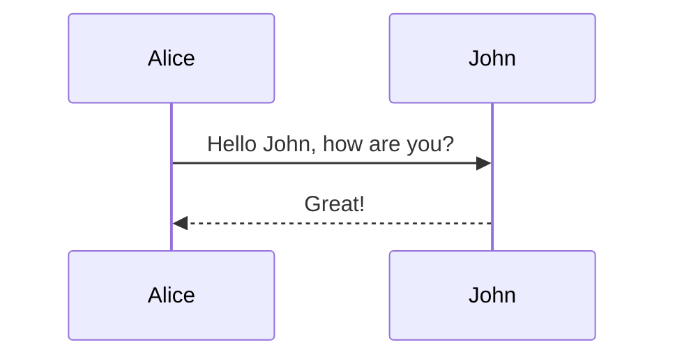

# 配当管理
## todo

### rest

- [x] ticker model 作成
- [x] 名称変更
- [x] 既存 model/serializer 修整
- [x] model/serializer 追加(dividends)
  - models.py, views.py, serializers.py
  - urls.py
- [x] select(filtering)
- [ ] model blankm null設定見直し
- [ ] unique constrains(Ticker.ticker & Dividend.ex_date)
- [ ] python client API(register tickers)
- [ ] authentication

### bs

- [ ] 組み込み




- tutorial 1

  ```text
  django-admin startproject divmanagement
  cd divmanagement
  python manage.py startapp dividends
  python manage.py startapp tickers

  INSTALLED_APPS = [
      ...
      'rest_framework',
      'dividends.apps.DividendsConfig',
      'dividends.apps.TickersConfig',
  ]

  edit models.py in tickers
  edit serializers.py in tickers

  python manage.py makemigrations tickers
  python manage.py migrate


  python manage.py shell
  ```

  ```
  from tickers.models import Ticker
  from tickers.serializers import TickerSerializer
  from rest_framework.renderers import JSONRenderer
  from rest_framework.parsers import JSONParser

  ticker = Ticker(ticker='mc', vol1=10, vol2=0, accum=1)
  ticker.save()

  ticker = Ticker(ticker='mss', vol1=5, vol2=2, accum=2)
  ticker.save()

  serializer = TickerSerializer(ticker)
  serializer.data

  content = JSONRenderer().render(serializer.data)
  content

  import io
  stream = io.BytesIO(content)
  data = JSONParser().parse(stream)
  data


  serializer = TickerSerializer(data=data)
  serializer.is_valid()
  # True
  serializer.validated_data
  OrderedDict([('ticker', 'mss'), ('vol1', 5), ('vol2', 2), ('accum', 2)])
  serializer.save()
  # <Snippet: Snippet object>

  ```

  tutorial 1 のリファクタリング。tickers/serializers.py

  ```
  class tickers(serializers.ModelSerializer):
      class Meta:
          model = Snippet
          fields = ['id', 'title', 'code', 'linenos', 'language', 'style']
  ```

  ```text
  from tickers.serializers import TickerSerializer
  serializer = TickerSerializer()
  print(repr(serializer))
  TickerSerializer():
      id = IntegerField(read_only=True)
      ticker = CharField(allow_blank=False, max_length=10, required=True)
      vol1 = IntegerField(min_value=0)
      vol2 = IntegerField(min_value=0)
      accum = IntegerField(min_value=0)

  ```

  tickers/views.py 編集
  tickers/urls.py 編集
  divmanagement/tutorial/urls.py 編集

  ```
  (stop shell) quit()
  python manage.py runserver

  http http://127.0.0.1:8000/tickers/
  http http://127.0.0.1:8000/tickers/ Accept:application/json
  http http://127.0.0.1:8000/tickers/ Accept:text/html


  ```

- tutorial 2
  views.py の実質置き換え
  tickers/urls.py 更新

  http http://127.0.0.1:8000/tickers/

  http --form POST http://127.0.0.1:8000/tickers/ ticker="cfg" vol1="5" vol2="0" accum="30"
  http --json POST http://127.0.0.1:8000/tickers/ ticker="hcsg" vol1="0" vol2="10" accum="30"

  http --debug http://127.0.0.1:8000/tickers/

- tutorial 3
  views.py の class 化
  tickers/urls.py 更新
  mixins を使って class ベース views の generic 化

  http --json POST http://127.0.0.1:8000/tickers/ ticker="psec" vol1="30" vol2="20" accum="100"

  (git commit --amend -m "tutorial 3 completed")

- tutorial 4
  ticker の models.py 修正

  rm -f db.sqlite3
  rm -r tickers/migrations
  python manage.py makemigrations tickers
  python manage.py migrate

  python manage.py createsuperuser
  admin
  amincs8000

  serializers.py 更新
  views.py にユーザー関連のビューを追加
  更に views.py の TickerList で perform_create を上書き

  serializers.py にユーザー関連付のためのステートメントを追加

  views.py で permissions を from test_framework で imports
  view.py の TickerList と TickerDetail に permission_classes=を追加

  プロジェクトレベル ulrs.py 編集

  browser で 127.0.0.1:8000/tickers/
  以下のデータを画面で入力
  ticker = Ticker(ticker='mc', vol1=10, vol2=0, accum=1)

  browser で 127.0.0.1:8000/tickers/1/
  で vol2 更新

  http://127.0.0.1:8000/api-auth/logout/
  http://127.0.0.1:8000/api-auth/login/

  ```
  Using the URLconf defined in divmanagement.urls, Django tried these URL patterns, in this order:

  admin/
  tickers/
  tickers<drf_format_suffix:format>
  tickers/<int:pk>/
  tickers/<int:pk><drf_format_suffix:format>
  api-auth/
  The empty path didn’t match any of these.
  ```

  http http://127.0.0.1:8000/tickers/ Accept:application/json
  http http://127.0.0.1:8000/tickers/1/ Accept:application/json
  http://127.0.0.1:8000/tickers/?Accept:application/json
  http://127.0.0.1:8000/tickers/1/?Accept:application/json
  http://127.0.0.1:8000/tickers/?Accept:application/json
  http://127.0.0.1:8000/tickers/1/?Accept:text/html

  object level permissions のため permissions.py を作成
  views.py 更新
  権限があれば delete、put が使えるようになる

- tutorial 5
  API へのシングルポイント views.py で@api_view
  highlight 関連は省略
  ulrs.py 編集

  serializers.py 更新は保留

  urls.py 更新

  pagenation は省略
