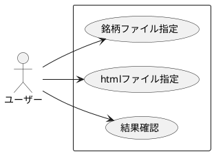
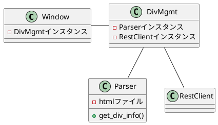
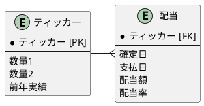

# 配当管理

ポートフォリオファイル選択
配当ファイル選択
ポートフォリオファイル読込み
配当ファイル読込み
　配当情報取得(ジェネレーター)
　配当情報登録
　配当情報表示準備
該当配当情報表示

リコンサイル
銘柄バッチ登録
銘柄バックアップ
配当情報バックアップ

## 流れ

1. 使用する機能を単体でコーディング
   - Beautiful Soup
     - 始めて使う。保存した html ファイルから必要な情報を抽出する
   - tkinter
     - 初めて使う。ファイル指定を GUI で行う
   - rest
     - 始めて使う。配当情報や銘柄情報を保管し、抽出
2. ドキュメント作成
3. インテグレーション

## 機能要件

- html ファイルに保管された、ある期間の配当情報を抽出
- 保有銘柄だった場合画面に表示
- 画面表示をコピーできる

## 非機能要件

今の所無し

## epic

- ユーザーとして、保有銘柄の配当確定日を知りたい
- ユーザーとして、該当銘柄の前年実績をあわせて知りたい

## ユースケース



### モジュール

当初は以下の図の上半分を想定していたが、bs.py(read_html())を置き換えることを想定すると下図下半分が良いと判断。bs.py(read_html())は対象 HTML に大きく依存し、変更が必要になる可能性が高いためできるだけ余計なことはさせない。


### クラス

- ウィンドウ
- 配当管理
- パーサー
- レストクライアント



- [ ] ウィンドウインスタンスを呼び出す際、配当管理インスタンスを引数として渡す
- [ ] ウィンドウインスタンスは、配当ファイルセット、銘柄ファイルセット、配当処理の 3 メソッドを利用
- [ ] 配当管理はパーサーに配当ファイル名を渡して配当情報を受取る(get_div_info)
- [ ] 配当管理はレストクライアントの record_div_info を利用する

## データベース



### 結果確認

1. 結果確認イメージ@1st ステージ

```
MSS 2021-10-18 3.1%
MC  2021-10-20 3.0%
```

2. 結果確認イメージ@2nd ステージ

```
MSS 2021-10-18 3.1%   |  昨年実績 10.2
MC  2021-10-20 3.0%   |  昨年実績 3.5
```

## 処理の流れ


#### GUI 呼出

#### ウィンドウ 1(ファイル指定)

#### ウィンドウ 2(パーサー呼出)

#### パーサー呼出

#### ファイル読込

#### 配当情報

#### 配当情報登録

#### 銘柄情報取得

#### 結果準備

#### ウィンドウ 2(結果表示)

## 1

### rest

- [ ] コピー
- [ ] 名称変更
- [ ]既存修整
- [ ] authentication
- [ ] 追加
- [ ] select

### bs

- [ ]

<!-- ```plantuml
@startuml
|メイン|
start
:GUI呼出;
|GUI|
:ウィンドウ1
(ファイル指定);
:ウィンドウ2
(パーサー呼出);

|x|
while (配当情報あり?)
  :配当情報読み込み;
  if ("保有銘柄") then
  else
    |as|
    :登録;
    |x|
    :結果準備;

  ' else
  endif
endwhile
:結果準備;
stop
@enduml
``` -->

## エラー処理

配当ファイルが存在しない
銘柄ファイルが存在しない
レストでエラー
銘柄情報が登録されていない
